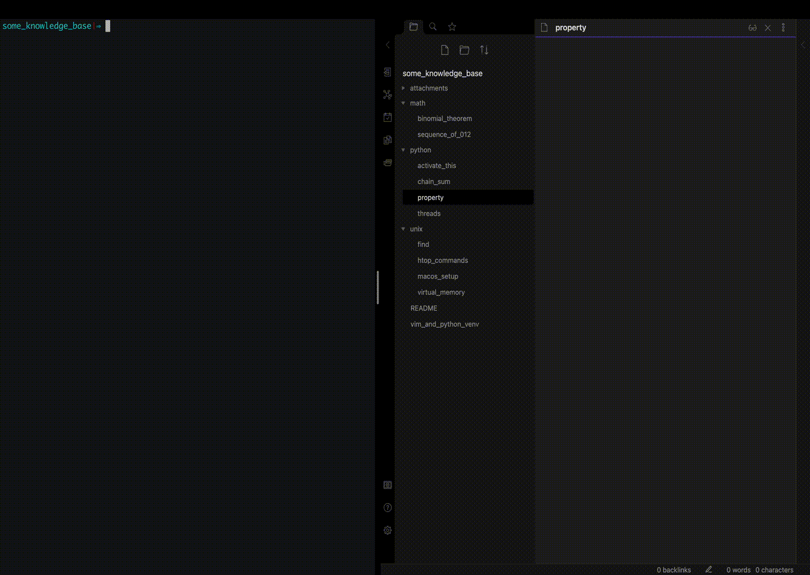

# Automatically generate table of contents for a file tree containing markdown files

Auto Summary allows to generate **table of contents** files for directory (and its
subdirectories) containing Markdown files. This can be useful for maintaining personal
knowledge database or team wiki. Auto summary can also watch your filetree and update all 
links on any file change, such as renaming, moving file around, deleting etc...

Auto Summary is availiable as a standalone **python script** and as **vim plugin**. 



## Contents

* [Python CLI utility](#python-cli-utility)
    - [Install](#install)
    - [Use](#use)
* [Vim plugin](#vim-plugin)
    - [Install Plugin](#install-plugin)
    - [Install watchdog](#install-watchdog)
    - [Use Plugin](#use-plugin)

### Python CLI utility

#### Install

1. Clone the repo  

`git clone https://github.com/technogleb/auto_summary.git ~/`

2. If you want to automatically watch for changes, you need to install
watchdog

```
pip3 install -r ~/auto_summary/requirements.txt
```

#### Use

1. Generate table of content

```python
python3 ~/auto_summary/cli.py -r path/to/your/markdown/root
```

If you want to have wikilinks instead of classic markdown links, pass --wikilinks option

```python
python3 ~/auto_summary/cli.py -r path/to/your/markdown/root --wikilinks
```

2. Automatically watch for changes

To automatically watch changes and update links, run cli with `--watch_changes` option. 
Note that it requires [watchdog](https://pypi.org/project/watchdog/) to be installed.

```python
python3 ~/auto_summary/cli.py -r path/to/your/markdown/root --watch_changes
```

### VIM plugin

Auto Summary can also be used as a Vim(NeoVim) plugin. 

#### Install plugin

1. Via your favorite plugin manager (here I use Vundle for example)

Add this to your .vimrc file (or to `~/.config/nvim/init.vim` if you use NeoVim)

```bash
Plugin technogleb/auto_summary
```

Don't forget to source your .vimrc later and run :PluginInstall

2. Manually 

```bash
mkdir -p ~/.vim/my_package/my_package/start
```

```bash
git clone https://github.com/technogleb/auto_summary.git ~/.vim/my_package/my_package/start
```

#### Install watchdog

In order to use automatic mode, you need to install watchdog. Installation differs for Vim
and NeoVim.

1. **Vim**

> NOTE: Auto Summary only supports python3.

> NOTE: Vim can only use the python it was compiled with, so you have to install watchdog 
in its' site-packages dir. 

> NOTE: watchdog may conflict with other plugins, using watchdog, such as YouCompleteMe

1. Find python, your vim was compiled with by `vim --version`

2. Install watchdog

```bash
/path/to/vim-compiled/python -m pip install -r ~/.vim/bundle/auto_summary/requirements.txt
```

1. **NeoVim**

Use you default system python3, or install it into virtual environment

```bash
pip3 install -r ~/.vim/bundle/auto_summary/requirements.txt
```

#### Use Plugin

1. Generate table of contents

`:Summarize` - generates table of contents, starting from your session root - i.e. where
you started your current vim session

`:Summarize <path/to/root>` - generates table of contents, starting from path specified

2. Automatically watch for changes

In order to automatically watch for changes, set `let g:watch_markdown_changes=1`
